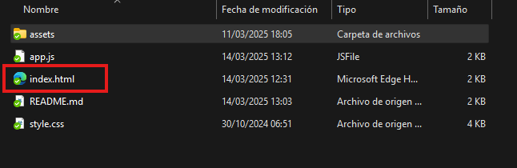

# 🎲 Mi Aplicación de Sorteo Random

Una app web que hice para sortear nombres al azar entre mis amigos. Súper simple pero funcional.

## ✨ Lo que hace

- **Fácil de usar**: Interfaz sencilla que cualquiera puede entender
- **Agregar nombres**: Puedes poner todos los nombres que quieras
- **Sin duplicados**: No deja meter el mismo nombre dos veces (para evitar trampas 😉)
- **Sorteo rápido**: Elige un nombre al azar con un solo clic
- **Suspenso incluido**: El resultado se muestra solo por 5 segundos y desaparece
- **Se ve bien en el celu**: Funciona en cualquier dispositivo

## 🛠️ Con qué lo hice

- JavaScript puro (sin frameworks ni nada fancy)

## 📋 Cómo usarlo

1. **Abre la app**: Dale doble clic al archivo `index.html`



2. **Mete los nombres**: Escribe y dale al botón "Añadir" (o Enter)


3. **Revisa la lista**: Asegúrate que están todos los nombres


4. **¡Sortea!**: Dale clic a "Sortear amigo"


1. **Mira rápido**: El ganador aparecerá por 5 segundos y luego... ¡puf! desaparece


## 💡 Detalles técnicos (por si te interesa)

### Lo de agregar nombres

- Cada nombre tiene que ser único (para que sea justo)
- No se permite dejar el campo en blanco
- Puedes usar el botón o darle Enter (porque la flojera es grande)

### El algoritmo del sorteo

- Es 100% aleatorio (usando Math.random, nada de trampas)
- Necesitas al menos 2 participantes (sino no tiene gracia)
- El resultado solo se ve 5 segundos para que puedan hacer varias rondas sin aburrirse

## 🧩 Archivos del proyecto

```
sorteo-nombres/
│
├── index.html          # El HTML principal
├── style.css           # Todos los estilos
├── app.js              # Mi código JavaScript
└── assets/
    └── images/         # Las imágenes
```

Hecho con ❤️ y mucho café por Jhoswe Genner Castro Castañeda
